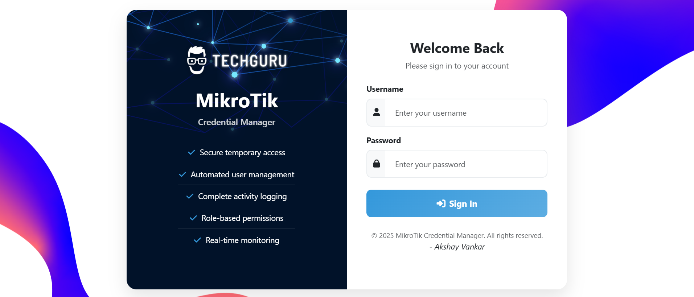

# MikroTik Credential Manager

A secure web-based platform for managing temporary credentials on MikroTik devices. This system allows technicians to request temporary access to MikroTik gateways without sharing permanent credentials.

## 🖼️ Login Page Preview


## 🌟 Features

### Core Functionality
- **Temporary Credential Generation**: Create time-limited user accounts on MikroTik devices
- **Automated Cleanup**: Automatically remove expired credentials and schedules
- **Multiple Duration Options**: 30 minutes, 1 hour, or 3 hours access
- **Purpose Tracking**: Require users to specify the reason for access
- **Real-time Monitoring**: Live countdown timers for active sessions

### Security Features
- **Role-Based Access Control**: Admin, Full Access, Write Access, and Read Only roles
- **Activity Logging**: Comprehensive audit trail of all system activities
- **Secure Authentication**: Password hashing and session management
- **IP-based Tracking**: Monitor access from different locations
- **Credential Isolation**: Each user gets unique temporary credentials

### User Management
- **Multi-role System**: Different permission levels for different users
- **User Administration**: Add, edit, delete, and manage user accounts
- **Activity History**: Track user actions and credential requests
- **Bulk Operations**: Manage multiple requests and users efficiently

### Administrative Features
- **System Dashboard**: Overview of system status and statistics
- **Comprehensive Logging**: Detailed activity logs with filtering and search
- **Export Capabilities**: Export logs and reports for compliance
- **Device Testing**: Test connectivity to MikroTik devices
- **Cleanup Tools**: Remove expired sessions and old logs

## 🏗️ Architecture

### Technology Stack
- **Backend**: FastAPI (Python)
- **Frontend**: Bootstrap 5 + Vanilla JavaScript
- **Database**: MySQL
- **MikroTik Integration**: RouterOS API
- **Authentication**: Session-based with secure cookies

### System Requirements
- Python 3.8+
- MySQL 5.7+ or MariaDB 10.3+
- Network access to MikroTik devices
- Modern web browser

## 🚀 Installation

## ⚡ Quick Installation (Automated)

For a quick setup, use the provided installation scripts:

### Windows Users
```cmd
install.bat
```

### Linux/Mac Users
```bash
chmod +x install.sh
./install.sh
```

### Docker Users
```bash
docker-compose up -d
```

## 📋 Manual Installation

### Prerequisites
- **Python 3.8+** (Recommended: Python 3.13)
- **MySQL 5.7+** or **MariaDB 10.3+**
- **Git** for cloning the repository

### 1. Clone the Repository
```bash
git clone https://github.com/aksha-y/Mikrotik-Cred-Manager.git
cd Mikrotik-Cred-Manager
```

### 2. Set Up Python Virtual Environment (Recommended)
```bash
# Create virtual environment
python -m venv .venv

# Activate virtual environment
# On Windows:
.venv\Scripts\activate
# On Linux/Mac:
source .venv/bin/activate
```

### 3. Install Dependencies
```bash
pip install -r requirements.txt
```

### 4. Set Up Database
Create a MySQL database for the application:
```sql
CREATE DATABASE mikrotik_cred_manager;
CREATE USER 'mikrotik_user'@'localhost' IDENTIFIED BY 'your_secure_password';
GRANT ALL PRIVILEGES ON mikrotik_cred_manager.* TO 'mikrotik_user'@'localhost';
FLUSH PRIVILEGES;
```

### 5. Configure Environment
Copy the example environment file and configure it:
```bash
cp .env.example .env
```

Edit the `.env` file with your settings (never commit this file):
```env
# Local development settings
DB_HOST=localhost
DB_PORT=3306
DB_NAME=mikrotik_cred_manager
DB_USER=mikrotik_user
DB_PASSWORD=your_secure_password

# Auth/session
SECRET_KEY=your-super-secret-key-change-this-in-production
ALGORITHM=HS256
ACCESS_TOKEN_EXPIRE_MINUTES=120
SECURE_COOKIES=false
ADMIN_DEFAULT_PASSWORD=admin/admin123

# MikroTik defaults
MIKROTIK_SERVICE_USER=your_service_user
MIKROTIK_SERVICE_PASSWORD=your_strong_service_password
MIKROTIK_API_PORT=20786
MIKROTIK_API_TLS=false
MIKROTIK_SERVICE_PASS=your_strong_service_password

# Application settings
HOST=127.0.0.1
PORT=8000
DEBUG=true
```

### 6. Initialize Database
```bash
python init_db.py
```

This will:
- Create all required database tables
- Set up the database schema
- Create initial system configuration

### 7. Set Up Admin User
Run the admin setup script to create the admin account:
```bash
python fix_admin_password.py
```

This will:
- Create the admin user if it doesn't exist
- Set the password with proper bcrypt hashing
- Activate the admin account

### 8. Start the Application
```bash
python run.py
```

The application will be available at `http://127.0.0.1:8000`

**Default Login Credentials:**
- **Username:** `admin`
- **Password:** `admin123`
- **URL:** `http://127.0.0.1:8000`

⚠️ **Important:** Change the default password immediately after first login!

### 9. Verify Installation
1. Open your web browser and navigate to `http://127.0.0.1:8000`
2. You should see the login page
3. Log in with the admin credentials
4. You should be redirected to the dashboard

### Troubleshooting Installation

#### Admin Login Not Working
If you can't log in with the admin credentials, run:
```bash
python check_admin.py
```
This will verify and fix the admin account.

#### Database Connection Issues
- Ensure MySQL/MariaDB is running
- Verify database credentials in `.env` file
- Check if the database exists and user has proper permissions

#### Port Already in Use
If port 8000 is already in use, change the PORT in your `.env` file:
```env
PORT=8001
```

## 🔧 Configuration

### MikroTik Device Setup
Before using the system, you need to set up a service account on each MikroTik device (replace placeholders with your own values):

```routeros
# Create service user group with API access (adjust policies to your needs)
/user group add name=api_service policy=api,read,write,policy,test

# Create service user (use the same credentials as in your .env file)
/user add name=your_service_user password=your_strong_service_password group=api_service

# Enable API service on custom port
/ip service enable api
/ip service set api port=20786
# Optional: Restrict API access to your management network
#/ip service set api address=192.168.100.0/24
```

**Important Configuration Notes:**
- The system is configured to use **port 20786** for MikroTik API connections by default
- Update your `.env` file with the correct `MIKROTIK_API_PORT=20786`
- Ensure your MikroTik devices have the API service running on this port
- For TLS/SSL connections, use port 8729 and set `MIKROTIK_API_TLS=true`
- The service user credentials in your `.env` file must match the user created on your MikroTik devices

### System Settings
After installation, update the system settings through the admin panel:
1. Login as admin
2. Navigate to System Settings
3. Update MikroTik service credentials
4. Configure other settings as needed

## 👥 User Roles

### Admin
- Full system access
- User management
- System configuration
- View all logs and activities
- Manage system settings

### Full Access
- Create credential requests
- View all credential requests
- Revoke any credentials
- View system statistics

### Write Access
- Create credential requests
- View own credential requests
- Revoke own credentials

### Read Only
- View own credential history
- No creation or modification rights

## 🔒 Security Considerations

### Best Practices
1. **Change Default Passwords**: Immediately change the default admin password
2. **Use Strong Passwords**: Enforce strong password policies
3. **Regular Updates**: Keep the system and dependencies updated
4. **Network Security**: Use HTTPS in production
5. **Access Control**: Limit network access to the application
6. **Regular Audits**: Review activity logs regularly

### MikroTik Security
1. **Service Account**: Use dedicated service accounts with minimal privileges
2. **API Security**: Secure the RouterOS API port
3. **Network Isolation**: Isolate management networks
4. **Regular Cleanup**: Monitor and clean up temporary accounts

## 📊 Usage

### For Technicians
1. **Login**: Access the web portal with your credentials
2. **Request Access**: Enter the WAN IP of the MikroTik device
3. **Specify Purpose**: Describe why you need access
4. **Choose Duration**: Select 30 minutes, 1 hour, or 3 hours
5. **Get Credentials**: Receive temporary username and password
6. **Connect**: Use the credentials to access the device
7. **Automatic Cleanup**: Credentials expire automatically

### For Administrators
1. **Monitor Activity**: View real-time dashboard
2. **Manage Users**: Add, edit, or remove user accounts
3. **Review Logs**: Check activity logs and audit trails
4. **System Maintenance**: Clean up expired sessions
5. **Export Reports**: Generate compliance reports

## 🔧 API Endpoints

### Authentication
- `POST /login` - User login
- `POST /logout` - User logout
- `GET /profile` - Get user profile

### Credential Management
- `POST /request-credentials` - Request new credentials
- `GET /my-requests` - Get user's requests
- `POST /revoke-credentials/{id}` - Revoke credentials
- `GET /api/test-connection/{ip}` - Test device connection

### Administration (Admin only)
- `GET /admin/users` - Manage users
- `POST /admin/users/create` - Create user
- `GET /admin/logs` - View activity logs
- `GET /admin/requests` - View all requests

## 🐛 Troubleshooting

### Common Issues

#### Database Connection Failed
- Check MySQL service is running
- Verify database credentials in `.env`
- Ensure database exists and user has permissions

#### MikroTik Connection Failed
- Verify RouterOS API is enabled
- Check service account credentials
- Ensure network connectivity
- Verify firewall rules

#### Credentials Not Working
- Check if credentials have expired
- Verify MikroTik device is accessible
- Ensure service account has proper permissions

### Logs and Debugging
- Application logs: Check console output
- Database logs: Check MySQL error logs
- Activity logs: Use the admin panel to view system logs

## 📈 Monitoring

### System Health
- Monitor database connections
- Check MikroTik device connectivity
- Review error logs regularly
- Monitor disk space and performance

### Security Monitoring
- Review failed login attempts
- Monitor unusual activity patterns
- Check for expired credentials cleanup
- Audit user access patterns

## 🔄 Maintenance

### Regular Tasks
- Clean up expired credentials
- Archive old activity logs
- Update system dependencies
- Review and update user accounts
- Backup database regularly

### Database Maintenance
```sql
-- Clean up old logs (older than 90 days)
DELETE FROM activity_logs WHERE created_at < DATE_SUB(NOW(), INTERVAL 90 DAY);

-- Clean up expired requests (older than 7 days)
DELETE FROM credential_requests WHERE status = 'expired' AND expires_at < DATE_SUB(NOW(), INTERVAL 7 DAY);
```

## 📝 License

This project is licensed under the MIT License - see the [LICENSE](LICENSE) file for details.

## 🤝 Contributing

1. Fork the repository
2. Create a feature branch
3. Make your changes
4. Add tests if applicable
5. Submit a pull request

## 📞 Support

For support and questions:
- Check the troubleshooting section
- Review the logs for error messages
- Create an issue in the repository
- Contact me at akshayvankariant@gmail.com

## 🔮 Future Enhancements

- **LDAP Integration**: Active Directory authentication
- **Email Notifications**: Automated alerts and reports
- **Mobile App**: Mobile interface for technicians
- **Advanced Reporting**: Detailed analytics and reports
- **Multi-tenant Support**: Support for multiple organizations
- **API Rate Limiting**: Enhanced security features
- **Backup/Restore**: Automated backup solutions
